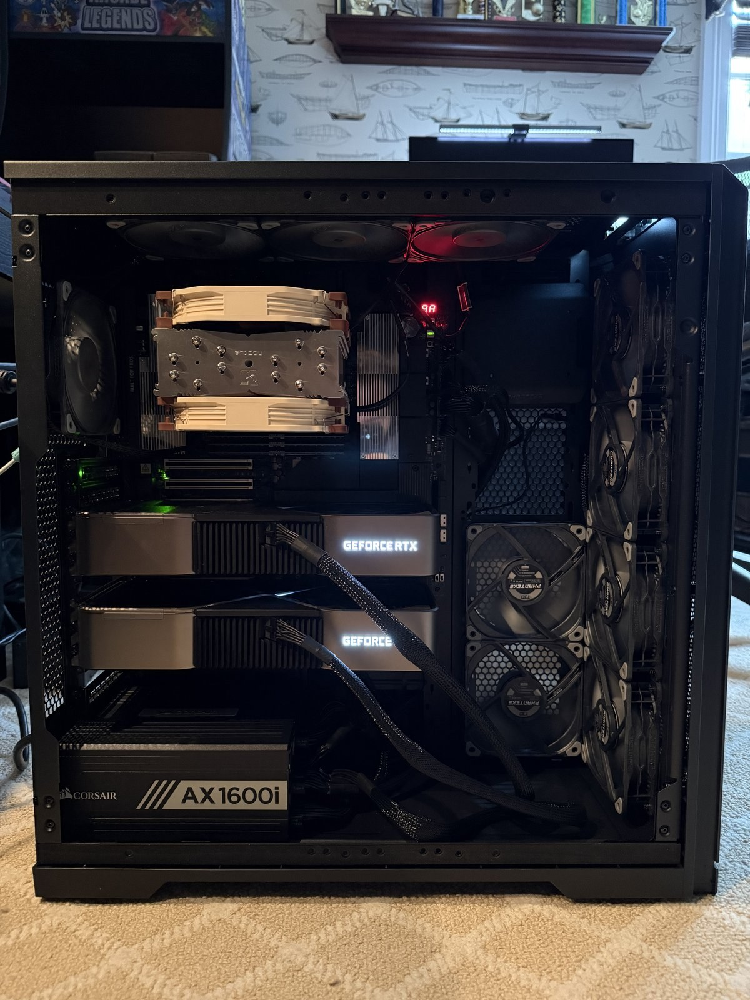
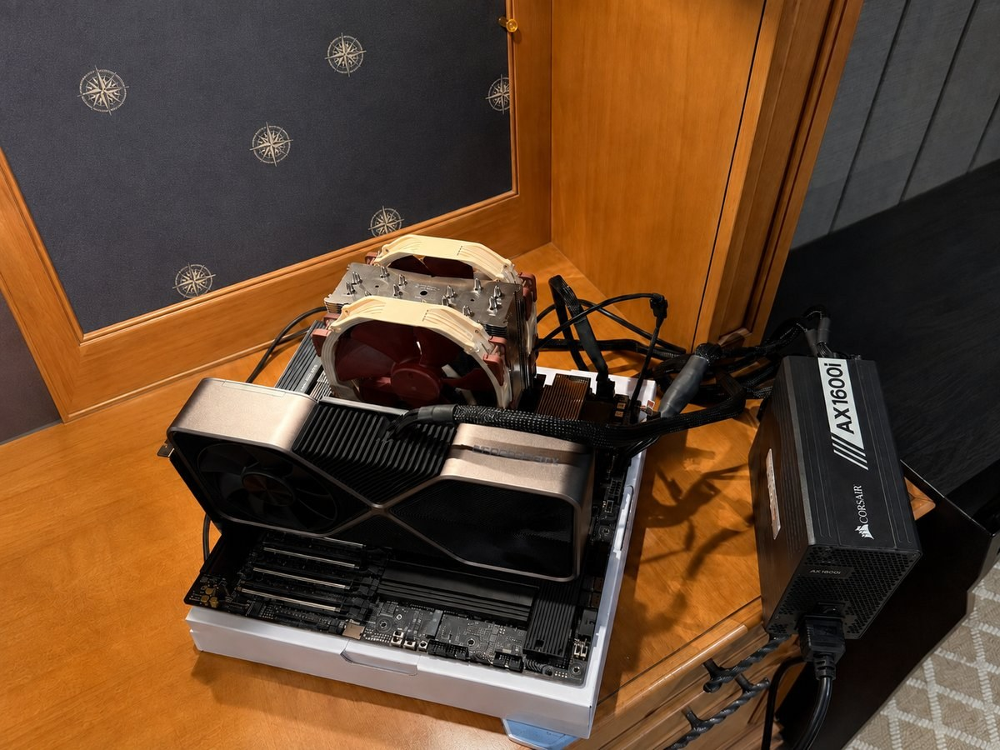
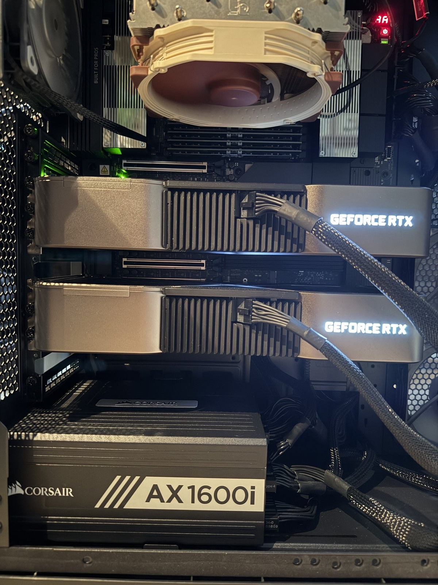
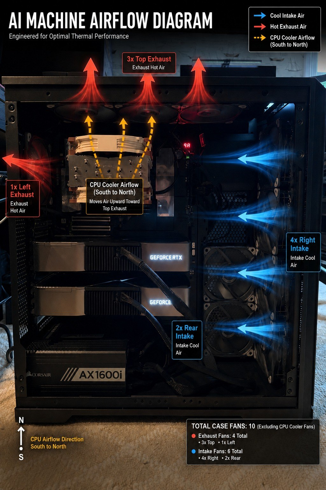

# Local LLM Infrastructure V2

  

A Linux-first, dual-GPU local AI server built around expansion capacity, memory bandwidth, airflow, remote recovery, and honest measurement.

This repository documents **Part 1: The Build**—the physical system, the architecture behind it, what it cost, how it was assembled, and the decisions that shaped it. Hardware commissioning and model evaluation are separate companion projects so that each part remains focused and independently useful.

> Read the accompanying article: [My New AI Cluster: Go Big or Go Home, Part 1](https://blog.zacharycangemi.com/2026/08/18/my-new-ai-cluster-go-big-or-go-home-part-1/)

## The system at a glance

| Component | Installed configuration |
|---|---|
| CPU | AMD Ryzen Threadripper PRO 9955WX — 16 cores / 32 threads |
| Motherboard | ASUS Pro WS WRX90E-SAGE SE |
| GPUs | 2× NVIDIA GeForce RTX 3090 Founders Edition |
| Physical VRAM | 48 GB combined; not automatically pooled |
| System memory | 128 GB Kingston FURY Renegade Pro DDR5-6400 ECC RDIMM — 8×16 GB |
| Active memory profile | DDR5-6000, EXPO Profile #2, 32-38-38-80 |
| Storage | Samsung 9100 PRO 2 TB PCIe 5.0 x4 NVMe |
| CPU cooling | Noctua NH-U14S TR5-SP6 with two NF-A15 fans |
| Chassis | Phanteks Enthoo Pro II Server Edition TG |
| Chassis cooling | 10× Phanteks T30-120 fans; six intake and four exhaust |
| Power supply | Corsair AX1600i — 1600 W, 80 Plus Titanium |
| Networking | Intel X710 dual-port 10GBASE-T adapter |
| Out-of-band management | ASPEED AST2600 BMC/IPMI on an isolated management path |
| Operating system | Ubuntu 24.04.4 LTS |
| Tracked acquisition value | **$10,769.55**, including historical paid protection plans |

The system has 128 GB of marketed RAM capacity; Linux exposes approximately 125 GiB usable. Each RTX 3090 reports 24,576 MiB. The 48 GB figure is combined physical capacity, not one transparent 48 GB memory pool.

## What changed from V1

V1 proved that two used RTX 3090s could make serious local inference practical. It also exposed the limits of building around a consumer desktop platform.

| Constraint | V1 | V2 |
|---|---|---|
| Platform | Consumer AM5 | WRX90 workstation |
| GPU links | PCIe Gen4 x8/x8 | PCIe Gen4 x16 per installed GPU under load |
| GPU spacing | Adjacent three-slot cards | One physical slot-width gap |
| Memory | 96 GB consumer UDIMM | 128 GB ECC RDIMM across eight channels |
| Operating system | Windows | Ubuntu Linux |
| Recovery | OS-level access | Independent BMC/IPMI plus SSH |
| Expansion strategy | Built around two cards | Built around future CPU, GPU, storage, and network changes |

Only five V1 items moved into V2: both RTX 3090 FEs, the AX1600i, and two dedicated Corsair GPU power cables.

## Design priorities

1. **Infrastructure before compute.** Keep the useful GPUs and invest in the platform beneath them.
2. **Expansion without consumer-platform compromises.** Preserve lanes, physical slots, storage options, and future accelerator choices.
3. **Memory as part of inference architecture.** Populate all eight channels and retain enough capacity for hybrid GPU/system-memory model placement.
4. **Remote recoverability.** Make POST, BIOS, sensors, and power recovery accessible independently of Ubuntu and the compute GPUs.
5. **Sustained-load cooling.** Engineer for long inference sessions rather than short gaming bursts.
6. **Receipts, limits, and mistakes included.** Separate measured facts from estimates and document what did not go as planned.

## Architecture

~~~mermaid
flowchart TB
    operator[Remote operator]
    bmc[ASPEED BMC / IPMI out-of-band recovery]
    linux[Ubuntu 24.04.4 LTS SSH and workload plane]
    cpu[Threadripper PRO 9955WX 16C / 32T]
    ram[128 GB ECC RDIMM 8 channels at DDR5-6000]
    root[WRX90 PCIe fabric]
    gpu0[RTX 3090 FE — GPU 0 24 GB / PCIe Gen4 x16]
    gpu1[RTX 3090 FE — GPU 1 24 GB / PCIe Gen4 x16]
    nvme[Samsung 9100 PRO 2 TB PCIe 5.0 x4]
    nic[Intel X710 dual-port 10GBASE-T]

    operator -->|management path| bmc
    operator -->|normal operations| linux
    bmc -. independent of OS and compute GPUs .-> root
    linux --> cpu
    cpu <--> ram
    cpu <--> root
    root <--> gpu0
    root <--> gpu1
    root <--> nvme
    root <--> nic
~~~

The public diagram deliberately omits addresses, credentials, serial numbers, and the physical location of the management endpoint.

## Build gallery

<table>
  <tr>
    <td align="center">
       
      Bench assembly and first-boot configuration
    </td>
    <td align="center">
       
      The GPU spacing V1 never had
    </td>
  </tr>
  <tr>
    <td colspan="2" align="center">
       
      Final airflow: six chassis intakes, four chassis exhausts, and two CPU-cooler fans
    </td>
  </tr>
</table>

## Cost snapshot

~~~mermaid
pie showData
    title Tracked machine acquisition value — $10,769.55
    "V2-specific cash purchases" : 8112.95
    "Gifted NVMe" : 326.32
    "V1 carryover and paid GPU plans" : 2330.28
~~~

| Scope | Post-tax total |
|---|---:|
| V2-acquired components, including the gifted NVMe | $8,439.27 |
| V1 hardware and paid GPU protection plans carried into V2 | $2,330.28 |
| **Total tracked machine acquisition value** | **$10,769.55** |

The total is historical acquisition accounting—not resale value, replacement cost, or current market value. See the [full public bill of materials](docs/bill-of-materials.md) and [machine-readable CSV](data/bill-of-materials.csv).

## Repository guide

| Path | Purpose |
|---|---|
| [docs/architecture.md](docs/architecture.md) | Platform topology and the reasoning behind WRX90 |
| [docs/build-notes.md](docs/build-notes.md) | Assembly order, firmware preparation, and lessons from build day |
| [docs/bill-of-materials.md](docs/bill-of-materials.md) | Public, reconciled cost ledger and accounting definitions |
| [docs/airflow.md](docs/airflow.md) | Fan placement, pressure strategy, and cooling tradeoffs |
| [docs/remote-operations.md](docs/remote-operations.md) | Privacy-safe recovery and management design |
| [docs/limitations-and-upgrades.md](docs/limitations-and-upgrades.md) | Known constraints, rejected claims, and upgrade path |
| [docs/sources.md](docs/sources.md) | First-party product documentation and project references |
| [data/bill-of-materials.csv](data/bill-of-materials.csv) | Reusable cost data behind the public tables |
| [scripts/validate_repo.py](scripts/validate_repo.py) | Cost reconciliation, local-link, and privacy-pattern checks |
| [LICENSE](LICENSE) | MIT license |

## The three-part series

| Part | Scope | Status |
|---|---|---|
| **1 — The Build** | Architecture, components, assembly, cost, cooling, and operating philosophy | **This repository — published** |
| **2 — Commissioning** | CPU, memory, GPU, VRAM, NCCL, storage, thermals, networking, and recovery evidence | Forthcoming companion repository and article |
| **3 — Local Model Testing** | Cross-model inference campaign, workload quality, TTFT, prefill, decode, and application evaluations | [Inference lab repository](https://github.com/zacangemi/local-llm-inference-lab); article forthcoming |

This separation is intentional: Part 1 explains what was built, Part 2 proves whether the hardware works, and Part 3 evaluates what the completed system can actually run.

## Honest boundaries

- The server is a single multi-GPU node, not a multi-node compute cluster.
- The two GPUs do not become one 48 GB CUDA device.
- No NVLink bridge is installed.
- Eleven T30 fans were purchased, but ten are installed; one is a spare/future option.
- The X710 is 10GbE-capable, while the current upstream path is slower.
- One 2 TB NVMe is active storage; archival storage and a separate backup remain future work.
- Maximum CPU plus maximum dual-GPU synthetic saturation found the current CPU-cooling boundary. That result belongs to Part 2 and is not hidden here.
- Whole-system wall power has not been directly metered. Component telemetry must not be presented as a wall-power measurement.

## Validate this repository

~~~bash
python3 scripts/validate_repo.py
~~~

The validator reconciles the public CSV to the published totals, verifies required files and local Markdown links, and checks public text files for common privacy leaks.

## Related work

- [Part 1 build article: My New AI Cluster: Go Big or Go Home, Part 1](https://blog.zacharycangemi.com/2026/08/18/my-new-ai-cluster-go-big-or-go-home-part-1/)
- [V1 build article: 48 GB of VRAM and a Dream](https://blog.zacharycangemi.com/2026/04/29/48-gb-of-vram-and-a-dream-part-1-the-build/)
- [V1 infrastructure repository](https://github.com/zacangemi/local-llm-infrastructure)
- [Local LLM Inference Lab](https://github.com/zacangemi/local-llm-inference-lab)
- [Project portfolio](https://zacharycangemi.com/portfolio.html)

## License

MIT — see [LICENSE](LICENSE).

---

Part of [Project Arrival](https://zacharycangemi.com)—a documented path from senior data science work toward AI systems and research engineering.
